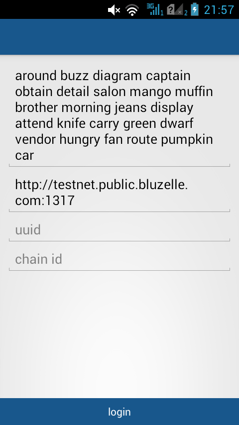
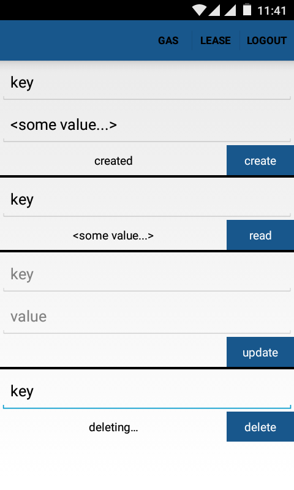

# Bluzelle Android

Install and configure [Android Studio](https://developer.android.com/studio/install).

Create new android project. On the step 'add an activity' select 'add no activity'.

Copy folder /app in the project directory, replacing all existing files.

Select menu > build > build apk.

Activate the option 'unknown origins' in the android device to launch this apk.

Download example of the android [app](https://github.com/aqoleg/blzjava/releases/download/0.5.0/bluzelle.apk).

    
