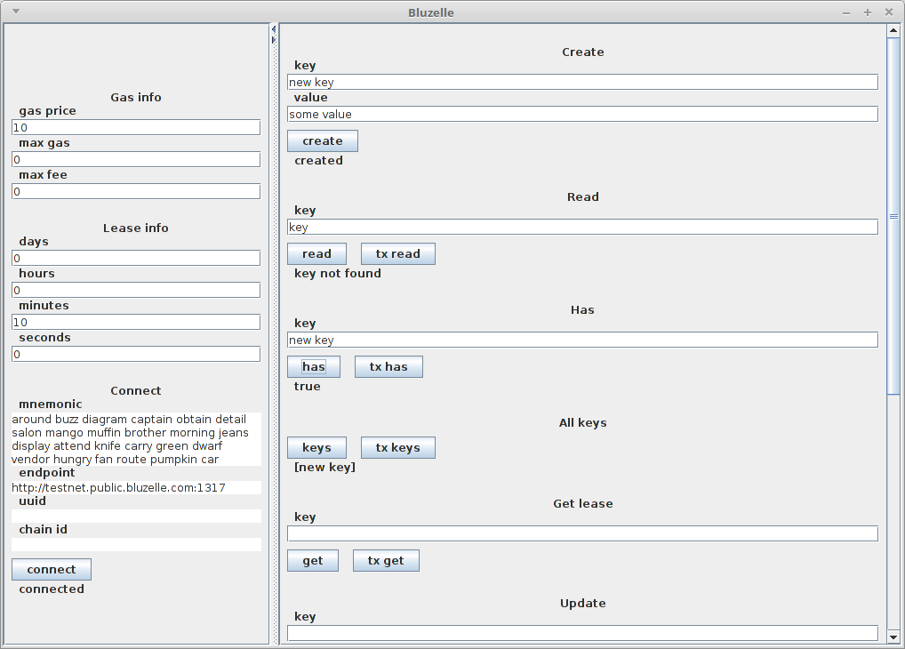

## Server.jar

Build from the source code.
Get the package from github.

    $ git clone https://github.com/bluzelle/blzjava.git

Create output directory.

    $ mkdir blzjava/out

Compile.

    $ javac -cp blzjava/src/:blzjava/examples/ -d blzjava/out/ blzjava/examples/server/Server.java

Create file server.jar.

    $ cd blzjava/out/
    $ jar cfe ../../server.jar server.Server ./
    $ cd ../../

The same file can be downloaded from [releases](https://github.com/aqoleg/blzjava/releases) or using terminal.

    $ wget https://github.com/aqoleg/blzjava/releases/download/0.5.0/server.jar

Enter the port number as a last argument. Run.

    $ java -jar server.jar 5000

Open other terminal.
Create connection.

    $ curl -d '{method:connect,args:["around buzz diagram captain obtain detail salon mango muffin brother morning jeans display attend knife carry green dwarf vendor hungry fan route pumpkin car","http://dev.testnet.public.bluzelle.com:1317"]}' localhost:5000

Create new key.

    curl -d '{method:create,args:[key,value,{gas_price:10},{seconds:90}]}' localhost:5000

Read the key.

    curl -d '{method:read,args:[key]}' localhost:5000

Delete all keys.

    curl -d '{method:deleteAll}' localhost:5000

Use any other method described in [API docs](../src/com/bluzelle).

    curl -d '{method:has,args:[key]}' localhost:5000

## CRUD

Get the package from github.

    $ git clone https://github.com/bluzelle/blzjava.git

Create output directory.

    $ mkdir blzjava/out

Compile.

    $ javac -cp blzjava/src/ -d blzjava/out/ blzjava/examples/Crud.java

Move to the output directory.

    $ cd blzjava/out/

Run. Read help.

    $ java Crud

Create new key.

    $ java Crud -c 'newKey' 'some value'

Read value of the key.

    $ java Crud -r 'newKey'

Update existing key.

    $ java Crud -u 'newKey' 'updated value'

Delete existing key.

    $ java Crud -d 'newKey'

## GUI

Build from the source code.
Get the package from github.

    $ git clone https://github.com/bluzelle/blzjava.git

Create output directory.

    $ mkdir blzjava/out

Compile.

    $ javac -cp blzjava/src/:blzjava/examples/ -d blzjava/out/ blzjava/examples/Gui.java

Create file gui.jar.

    $ cd blzjava/out/
    $ jar cfe ../../gui.jar Gui ./
    $ cd ../../

The same file can be downloaded from [releases](https://github.com/aqoleg/blzjava/releases) or using terminal.

    $ wget https://github.com/aqoleg/blzjava/releases/download/0.5.0/gui.jar

Run and use GUI.

    $ java -jar gui.jar

## One more example

Download bluzelle.jar from [releases](https://github.com/aqoleg/blzjava/releases) or using terminal.

    $ wget https://github.com/aqoleg/blzjava/releases/download/0.5.0/bluzelle.jar

Copy file Threads.java or get file from the package.

    $ git clone https://github.com/bluzelle/blzjava.git
    $ mv blzjava/examples/Threads.java Threads.java

Compile.

    $ javac -cp ./bluzelle.jar Threads.java

Run.

    $ java -cp .:./bluzelle.jar Threads

This will create multiple key-value pairs and simultaneously read all the keys every 2 seconds.

